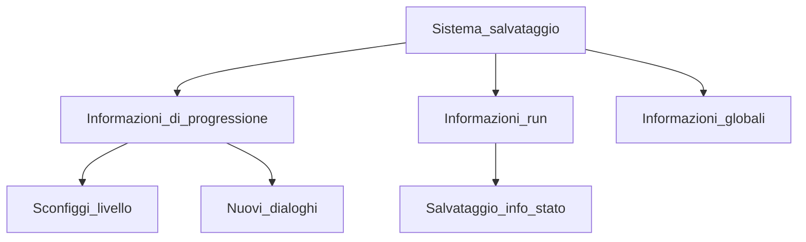

### Sistema di Salvataggio

In prima istanza il sistema di salvataggio procederà innanzitutto a salvare le info di progressione che verranno aggiornate una volta battuto uno specifico livello, per cui il sistema salverà lo stato di progressione e fornirà nuovi dialoghi riguardanti la storia, nel momento in cui non si verificherà il superamento del livello le opzioni non verranno aggiornate.

In seconda istanza il sistema salverà le informazioni riguardanti la run, quindi se il giocatore esce dal gioco durante la run verranno salvate le info riguardanti lo stato ovvero: livello, inventario, personaggio e nemici. Nel caso in cui il giocatore torna al gioco il sitema fornirà al giocatore lo stato di gioco precedentemente salvato.

In ultima istanza il sistema salverà le statistiche del personaggio quindi verrà salvata la progressione delle statistiche che vengono migliorate dal giocatore nell'hub principale.