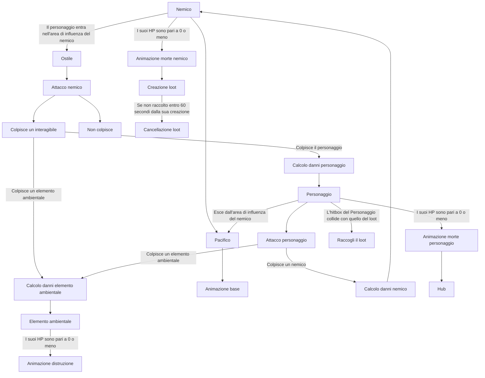

# Caso d'uso combattimento

```mermaid
flowchart TD
N[Nemico] --> |Il personaggio entra nell'area di influenza del nemico| O[Ostile]
O[Ostile] --> B[Attacco nemico]
N[Nemico] --> P[Pacifico]
B[Attacco nemico] --> C[Colpisce un interagibile]
C[Colpisce un interagibile] --> |Colpisce il personaggio| D[Calcolo danni personaggio]
C[Colpisce un interagibile] --> |Colpisce un elemento ambientale| E[Calcolo danni elemento ambientale]
B[Attacco nemico] --> F[Non colpisce]
D[Calcolo danni personaggio] -->  A[Personaggio]
E[Calcolo danni elemento ambientale] --> G[Elemento ambientale]
P[Pacifico] --> Q[Animazione base]
A[Personaggio] --> |Esce dall'area di influenza del nemico| P[Pacifico]
A[Personaggio] --> H[Attacco personaggio]
H[Attacco personaggio] --> |Colpisce un nemico| I[Calcolo danni nemico]
H[Attacco personaggio] --> |Colpisce un elemento ambientale| E[Calcolo danni elemento ambientale]
I[Calcolo danni nemico] --> N[Nemico]
G[Elemento ambientale] --> |I suoi HP sono pari a 0 o meno| J[Animazione distruzione]
A[Personaggio] --> |I suoi HP sono pari a 0 o meno| K[Animazione morte del personaggio]
K[Animazione morte personaggio] --> L[Hub]
N[Nemico] --> |I suoi HP sono pari a 0 o meno| M[Animazione morte nemico]
M[Animazione morte nemico] --> R[Creazione loot]
A[Personaggio] --> |L'hitbox del Personaggio collide con quello del loot| S[Raccogli il loot]
R[Creazione loot] --> |Se non raccolto entro 60 secondi dalla sua creazione| T[Cancellazione loot]

```