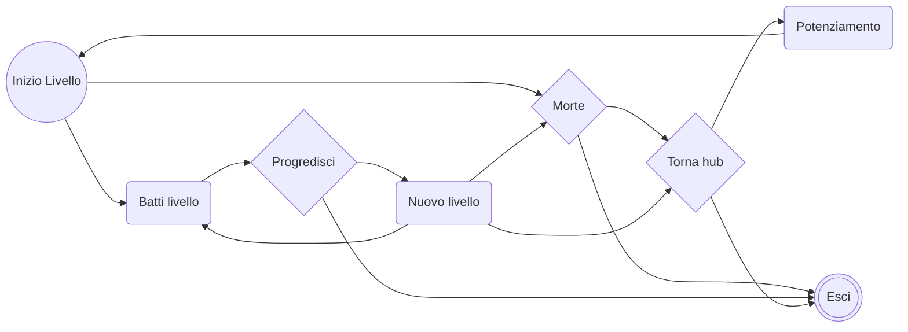

# Caso d'uso progressione

```mermaid
flowchart LR
A@{ shape: circle, label: "Inizio Livello" } --> B@{ shape: diamond, label: "Morte" }
B --> G@{ shape: diamond, label: "Torna hub" }
B -->C@{ shape: dbl-circ, label: "Esci" }
G --> H@{ shape: rounded, label: "Potenziamento" }
A --> D@{ shape: rounded, label: "Batti livello" }
D -->  E@{ shape: diamond, label: "Progredisci" }
E --> C
E --> F
H --> A
F@{ shape: rounded, label: "Nuovo livello" } --> D
F --> B
F --> G
G -->C
```