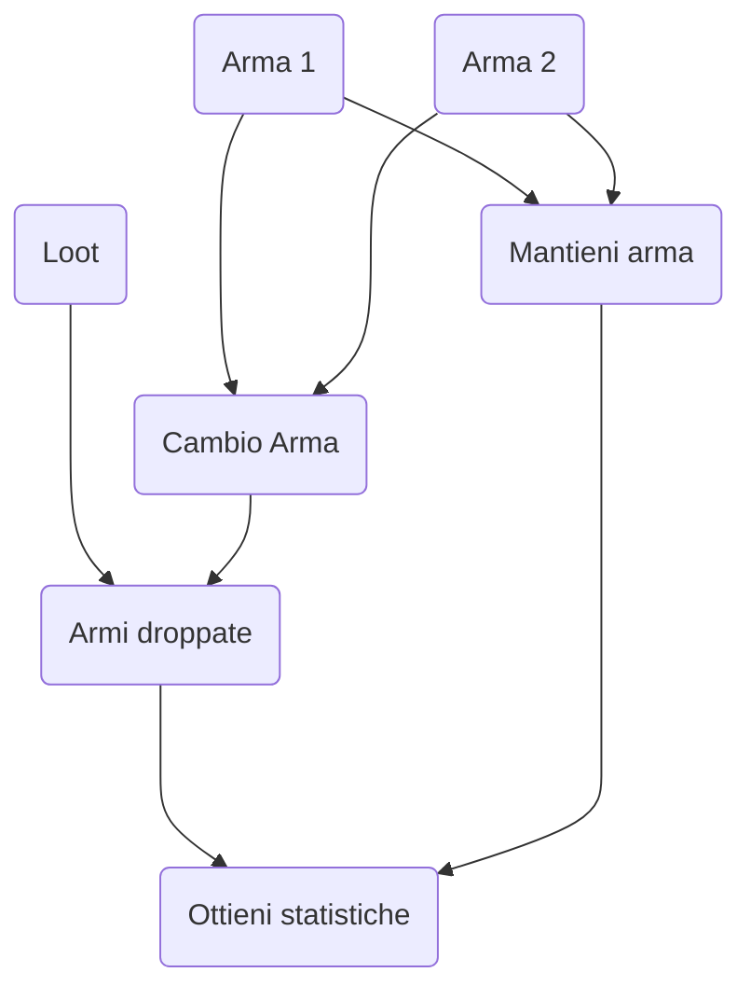

# Casi d'uso inventario

```mermaid
flowchart TD
id1(Arma 1)--->id3(Cambio Arma)
id2(Arma 2)--->id3
id4(Loot)--->id5(Armi droppate)
id3-->id5
id5--->id6(Ottieni statistiche)
id1-->id7(Mantieni arma)
id2-->id7
id7-->id6
```