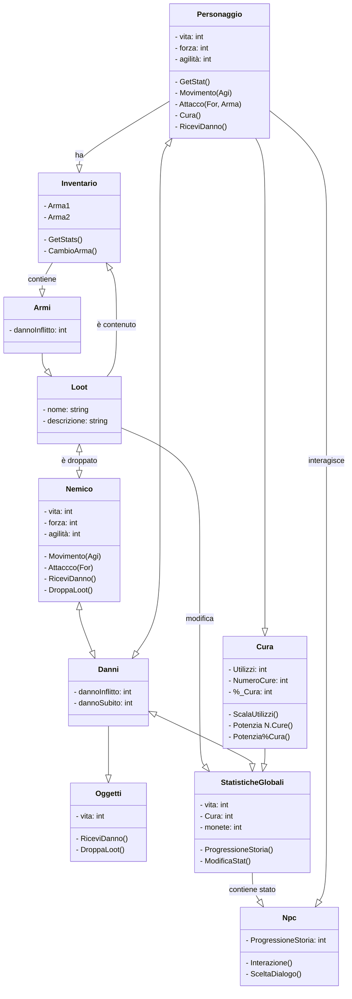

# CLASSI UTILIZATE

## Qui verranno descritte e classi che interagiranno tra di loro nel corso del gioco

#### PERSONAGGIO

1. Attributi

- Vita (int)
- Forza (int)
- Agilità (int)

2. Funzioni

- GetStat
- Movimento (Agi)
- Attacco (For,Arma)
- Cura
- RiceviDanno

#### NEMICO

1. Attributi

- Vita (int)
- Forza (int)
- Agilità (int)

2. Funzioni

- Movimento (Agi)
- Attacco (For)
- RiceviDanno
- DroppaLoot

#### OGGETTI

1. Attributi

- Vita (int)

2. Funzioni

- RiceviDanno
- DroppaLoot

#### CURA

1. Attributi

- Utilizzi (int)
- NumeroCure (int)
- %_Cura (int)

2. Funzioni

- ScalaUtilizzi
- Potenzia N.Cure
- Potenzia%Cura

#### NPC

1. Attributi

- ProgressioneStoria (int)

2. Funzioni

- Interazione
- SceltaDialogo (Prog. Storia)

#### INVENTARIO

1. Attributi

- Arma1
- Arma2

2. Funzioni

- GetStats
- CambioArma

#### DANNI 

1. Attributi

    - dannoInflitto: int
    - dannoSubito: int

#### ARMI

1. Attributi

    - dannoInflitto: int
    

#### LOOT 

1. Attributi
        - nome: string
        - descrizione: string

#### STATISTICHE GLOBALI  

1. Attributi

    - vita: int
    - Cura: int
    - monete: int

2. Funzione

    - ProgressioneStoria()
    - ModificaStat()
### DIAGRAMMA DI CLASSE
